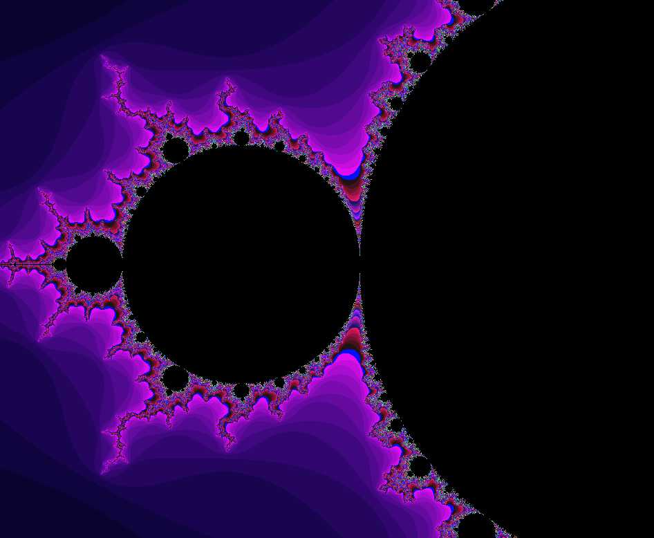

# CPPND: Capstone Mandelbrot Repo
This is the repo for the Mandelbrot viewer based on the starter repo for the Capstone project in the [Udacity C++ Nanodegree Program](https://www.udacity.com/course/c-plus-plus-nanodegree--nd213).

Program controlled using the following keys:
| _Key_         | _Action_          |
|---------------|-------------------|
|<kbd>Esc</kbd> | Quit              |
|<kbd>←</kbd>   | Move left         |
|<kbd>↑</kbd>   | Move up           |
|<kbd>→</kbd>   | Move right        |
|<kbd>↓</kbd>   | Move down         |
|<kbd>=</kbd>   | Zoom in           |
|<kbd>-</kbd>   | Zoom out          |



## Dependencies for Running Locally
* cmake >= 3.7
  * All OSes: [click here for installation instructions](https://cmake.org/install/)
* make >= 4.1 (Linux, Mac), 3.81 (Windows)
  * Linux: make is installed by default on most Linux distros
  * Mac: [install Xcode command line tools to get make](https://developer.apple.com/xcode/features/)
  * Windows: [Click here for installation instructions](http://gnuwin32.sourceforge.net/packages/make.htm)
* gcc/g++ >= 5.4
  * Linux: gcc / g++ is installed by default on most Linux distros
  * Mac: same deal as make - [install Xcode command line tools](https://developer.apple.com/xcode/features/)
  * Windows: recommend using [MinGW](http://www.mingw.org/)
* SDL2
  * Linux: sudo apt-get update
           sudo apt-get install libsdl2-dev

## Basic Build Instructions

1. Clone this repo.
2. Make a build directory in the top level directory: `mkdir build && cd build`
3. Compile: `cmake .. && make`
4. Run it: `./Mandelbrot`.


## Directory layout
```bash
.
├── src             # source files.
|   ├── Fractal.cpp # mandelbrot computation logic
|   ├── Fractal.h
|   ├── main.cpp
|   ├── Point.cpp   # sample point
|   ├── Point.h
|   ├── Viewer.cpp  # top-level class, interactive viewer
|   └── Viewer.h
├── CMakeLists.txt  # build config
├── README.md
└── notes.txt       # location of reference material
```

## Rubric points met

### Loops, Functions, I/O

| Criteria | Meets Specifications |
| --- | --- |
| The project demonstrates an understanding of C++ functions and control structures. | All |
| A variety of control structures are used in the project. | All |
| The project code is clearly organized into functions. | All |
| The project reads data from a file and process the data, or the program writes data to a file. | - |
| The project reads data from an external file or writes data to a file as part of the necessary operation of the program. | - |
| The project accepts user input and processes the input. | Viewer.cpp |
| The project accepts input from a user as part of the necessary operation of the program. | Viewer.cpp |

## Object Oriented Programming
| Criteria | Meets Specifications |
| --- | --- |
| The project uses Object Oriented Programming techniques. | All |
| The project code is organized into classes with class attributes to hold the data, and class methods to perform tasks. | All |
| Classes use appropriate access specifiers for class members. | All |
| All class data members are explicitly specified as public, protected, or private. | Fractal.h, Viewer.h, Point.h |
| Class constructors utilize member initialization lists. | Fractal.cpp, Viewer.cpp |
| All class members that are set to argument values are initialized through member initialization lists. | Fractal.cpp, Viewer.cpp |
| Classes abstract implementation details from their interfaces. | All |
| All class member functions document their effects, either through function names, comments, or formal documentation. Member functions do not change program state in undocumented ways. | Fractal.h, Viewer.h, Point.h |
| Classes encapsulate behavior. | Fractal.h, Point.h, Viewer.h |
| Appropriate data and functions are grouped into classes. Member data that is subject to an invariant is hidden from the user. State is accessed via member functions. | Fractal.cpp, Point.cpp, Viewer.cpp |
| Classes follow an appropriate inheritance hierarchy. | - |
| Inheritance hierarchies are logical. Composition is used instead of inheritance when appropriate. Abstract classes are composed of pure virtual functions. Override functions are specified. | - |
| Overloaded functions allow the same function to operate on different parameters. | - |
| One function is overloaded with different signatures for the same function name. | - |
| Derived class functions override virtual base class functions. | - |
| One member function in an inherited class overrides a virtual base class member function. | - |
| Templates generalize functions in the project. | - |
| One function is declared with a template that allows it to accept a generic parameter. | - |


## Memory Management
| Criteria | Meets Specifications |
| -- | -- |
| The project makes use of references in function declarations. | - |
| At least two variables are defined as references, or two functions use pass-by-reference in the project code. | - |
| The project uses destructors appropriately. | - |
| At least one class that uses unmanaged dynamically allocated memory, along with any class that otherwise needs to modify state upon the termination of an object, uses a destructor. | - |
| The project uses scope / Resource Acquisition Is Initialization (RAII) where appropriate. | - |
| The project follows the Resource Acquisition Is Initialization pattern where appropriate, by allocating objects at compile-time, initializing objects when they are declared, and utilizing scope to ensure their automatic destruction. | - |
| The project follows the Rule of 5. | - |
| For all classes, if any one of the copy constructor, copy assignment operator, move constructor, move assignment operator, and destructor are defined, then all of these functions are defined. | - |
| The project uses move semantics to move data, instead of copying it, where possible. | main.cpp |
| For classes with move constructors, the project returns objects of that class by value, and relies on the move constructor, instead of copying the object. | - |
| The project uses smart pointers instead of raw pointers. | main.cpp |
|The project uses at least one smart pointer: unique_ptr, shared_ptr, or weak_ptr. The project does not use raw pointers. | main.cpp, Viewer.cpp |

## Concurrency
| Criteria | Meets Specifications |
| -- | -- |
| The project uses multithreading. | Fractal.cpp |
| The project uses multiple threads in the execution. | Fractal.cpp |
| A promise and future is used in the project. | Fractal.cpp |
| A promise and future is used to pass data from a worker thread to a parent thread in the project code. | - |
| A mutex or lock is used in the project. | - |
| A mutex or lock (e.g. std::lock_guard or `std::unique_lock) is used to protect data that is shared across multiple threads in the project code. | - |
| A condition variable is used in the project. | - |
| A std::condition_variable is used in the project code to synchronize thread execution. | - |
